# Architecture & Instrumentation Flow

This document explains the application flow, instrumentation points, and the challenge of trace context propagation in simple terms.

---

## 📊 Application Architecture

```mermaid
graph TB
    User([👤 User]) -->|Submits Form| Browser[🌐 Browser<br/>Nuxt Frontend]
    Browser -->|POST /api/hash| Server[⚙️ Server<br/>Nuxt/Nitro Backend]
    Server -->|SHA256 Hash| Browser
    Browser -->|Display Result| User
    
    style User fill:#e1f5ff
    style Browser fill:#fff4e1
    style Server fill:#e8f5e9
```



### Simple Flow:
1. **User** types a message in the form
2. **Browser** (Frontend) sends the message to the server
3. **Server** (Backend) calculates the hash
4. **Browser** receives and displays the hash

---

## 🔍 The Problem: Disconnected Traces

### Without Proper Instrumentation

```mermaid
sequenceDiagram
    participant User as 👤 User
    participant Browser as 🌐 Browser<br/>(Frontend)
    participant Server as ⚙️ Server<br/>(Backend)
    participant DT as 📊 Dynatrace

    User->>Browser: Submit Form
    activate Browser
    Note over Browser: ❓ No Monitoring
    Browser->>Server: POST /api/hash
    activate Server
    Note over Server: ❓ No Monitoring
    Server-->>Browser: Response
    deactivate Server
    Browser-->>User: Show Hash
    deactivate Browser
    
    Note over DT: ❌ NO VISIBILITY<br/>Can't see what's happening!
```



**Problem:** Complete blindness - no visibility into user actions, performance, or errors.

---

## 🎯 Step 1: Add Frontend Monitoring (RUM)

```mermaid
sequenceDiagram
    participant User as 👤 User
    participant Browser as 🌐 Browser<br/>(Frontend + RUM)
    participant Server as ⚙️ Server<br/>(Backend)
    participant DT as 📊 Dynatrace

    User->>Browser: Submit Form
    activate Browser
    Note over Browser: ✅ RUM Tracking<br/>Trace ID: ABC123
    Browser->>DT: Send RUM data<br/>Trace: ABC123
    Browser->>Server: POST /api/hash
    activate Server
    Note over Server: ❓ No Monitoring
    Server-->>Browser: Response
    deactivate Server
    Browser-->>User: Show Hash
    deactivate Browser
    
    Note over DT: ✅ Frontend visible<br/>❌ Backend invisible
```



**Progress:** Can see user actions and frontend performance, but backend is still blind.

---

## ⚠️ Step 2: Add Backend OpenTelemetry (BROKEN)

### The Broken Scenario

```mermaid
sequenceDiagram
    participant User as 👤 User
    participant Browser as 🌐 Browser<br/>(Frontend + RUM)
    participant Server as ⚙️ Server<br/>(Backend + OTel)
    participant DT as 📊 Dynatrace

    User->>Browser: Submit Form
    activate Browser
    Note over Browser: ✅ RUM Tracking<br/>Trace ID: ABC123
    Browser->>DT: Send RUM data<br/>Trace: ABC123
    Browser->>Server: POST /api/hash<br/>Header: traceparent=ABC123
    activate Server
    Note over Server: ❌ Creates NEW Trace!<br/>Trace ID: XYZ789<br/>(Ignores traceparent)
    Server->>DT: Send OTel span<br/>Trace: XYZ789
    Server-->>Browser: Response
    deactivate Server
    Browser-->>User: Show Hash
    deactivate Browser
    
    Note over DT: ⚠️ TWO SEPARATE TRACES<br/>Frontend: ABC123<br/>Backend: XYZ789<br/>DISCONNECTED!
```



**The Problem:**
- Frontend creates trace `ABC123` ✅
- Frontend sends `traceparent: ABC123` to backend ✅
- Backend **ignores** the header ❌
- Backend creates **NEW** trace `XYZ789` ❌
- Result: Two disconnected traces in Dynatrace ❌

---

## ✅ Step 3: The Solution (Working Trace Propagation)

```mermaid
sequenceDiagram
    participant User as 👤 User
    participant Browser as 🌐 Browser<br/>(Frontend + RUM)
    participant Server as ⚙️ Server<br/>(Backend + Manual Propagation)
    participant DT as 📊 Dynatrace

    User->>Browser: Submit Form
    activate Browser
    Note over Browser: ✅ RUM Tracking<br/>Trace ID: ABC123
    Browser->>DT: Send RUM data<br/>Trace: ABC123
    Browser->>Server: POST /api/hash<br/>Header: traceparent=ABC123
    activate Server
    Note over Server: ✅ Reads traceparent<br/>✅ Continues Trace ABC123<br/>✅ Creates child span
    Server->>DT: Send OTel span<br/>Trace: ABC123
    Server-->>Browser: Response
    deactivate Server
    Browser-->>User: Show Hash
    deactivate Browser
    
    Note over DT: ✅ ONE CONNECTED TRACE<br/>Frontend → Backend<br/>Trace: ABC123<br/>WORKING!
```



**The Solution:**
- Frontend creates trace `ABC123` ✅
- Frontend sends `traceparent: ABC123` to backend ✅
- Backend **reads and parses** the header ✅
- Backend **continues** the same trace `ABC123` ✅
- Result: One complete end-to-end trace in Dynatrace ✅

---

## 🔧 Technical Details

### The traceparent Header

```
Format: version-traceId-spanId-flags
Example: 00-ABC123...-DEF456...-01
```

This header contains:
- **Trace ID**: Unique identifier for the entire trace
- **Span ID**: Identifier for the current operation
- **Flags**: Control flags (sampling, etc.)

### Why Standard Instrumentation Fails

```mermaid
graph TB
    subgraph "❌ Automatic Instrumentation (Broken)"
        Browser1[Browser sends<br/>traceparent: ABC123]
        NitroAuto[NitroInstrumentation]
        Propagator[W3CTraceContextPropagator.extract]
        NewTrace[Creates NEW trace: XYZ789]
        
        Browser1 --> NitroAuto
        NitroAuto --> Propagator
        Propagator -.->|Returns empty context| NewTrace
    end
    
    subgraph "✅ Manual Instrumentation (Working)"
        Browser2[Browser sends<br/>traceparent: ABC123]
        Manual[Manual Plugin]
        Parse[Parse header manually]
        CreateContext[Create span context]
        ContinueTrace[Continue trace: ABC123]
        
        Browser2 --> Manual
        Manual --> Parse
        Parse --> CreateContext
        CreateContext --> ContinueTrace
    end
    
    style NewTrace fill:#ffebee
    style ContinueTrace fill:#e8f5e9
```



**Why it breaks:**
- `W3CTraceContextPropagator.extract()` reads the header ✅
- But returns an **invalid/empty** span context in Nitro environment ❌
- OpenTelemetry sees no parent context ❌
- Creates a new trace instead ❌

**How we fix it:**
- Manually parse the `traceparent` header ✅
- Manually create the span context object ✅
- Pass it to OpenTelemetry SDK ✅
- Continue the trace properly ✅

---

## 📈 Dynatrace View Comparison

### Before (Broken)

```
Distributed Traces
├─ 📱 Frontend Trace (ABC123)
│  └─ User Action → API Call
│
└─ 🖥️ Backend Trace (XYZ789)  ← DISCONNECTED!
   └─ HTTP POST /api/hash
```

**Problem:** Two separate traces, can't see the full picture!

### After (Working)

```
Distributed Traces
└─ 📱→🖥️ Complete Trace (ABC123)  ← CONNECTED!
   ├─ User Action (Frontend)
   └─ HTTP POST /api/hash (Backend)
```

**Success:** One trace showing the complete journey from user click to server response!

---

## 🎓 Key Takeaways

### For Non-Technical Audience

1. **The Goal**: See the complete journey of a user request from browser to server and back
2. **The Challenge**: Standard tools don't connect frontend and backend traces properly
3. **The Solution**: We manually connect the traces by parsing special headers
4. **The Result**: Full visibility into your application's behavior

### Visual Summary

```mermaid
graph LR
    A[👤 User Action] -->|RUM tracks| B[🌐 Frontend Trace]
    B -->|sends traceparent| C{Backend reads header?}
    C -->|❌ No<br/>Automatic| D[🖥️ NEW trace<br/>DISCONNECTED]
    C -->|✅ Yes<br/>Manual| E[🖥️ SAME trace<br/>CONNECTED]
    
    D -->|Result| F[❌ Two separate traces<br/>Can't see full picture]
    E -->|Result| G[✅ One complete trace<br/>Full visibility]
    
    style D fill:#ffebee
    style E fill:#e8f5e9
    style F fill:#ffebee
    style G fill:#e8f5e9
```



### The Business Value

| Aspect | Without Solution | With Solution |
|--------|-----------------|---------------|
| **Visibility** | Partial (frontend only) | Complete (end-to-end) |
| **Debugging** | Difficult (disconnected) | Easy (full context) |
| **Performance** | Frontend metrics only | Full stack metrics |
| **Error Tracking** | Frontend errors only | Complete error chain |
| **User Experience** | Browser-side view | Complete journey |

---

## 🚀 Implementation Branches

See the different stages in action:

1. **plain_nuxt_app** - No monitoring (blind)
2. **dynatrace_rum_nuxt** - Frontend only (partial vision)
3. **nuxt_open_telemetry** - Both instrumented but disconnected (broken)
4. **main** - Fully connected traces (working!)

Each branch demonstrates a stage in the journey to complete observability.
